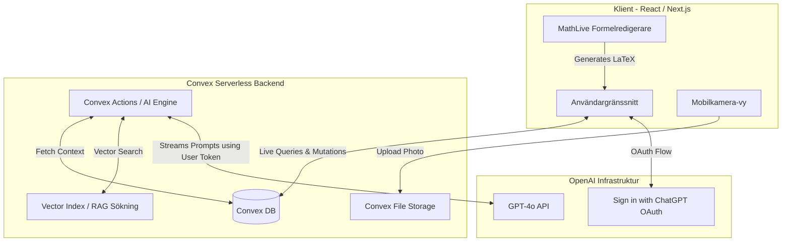
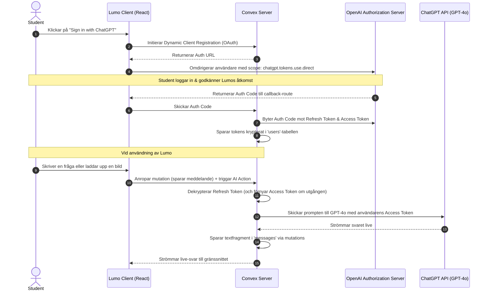

# Lumo: Produkt- och Teknisk Systemspecifikation

Denna specifikation beskriver **Lumo** – en intelligent, interaktiv studieplattform för studenter inom matematik, naturvetenskap och teknik. Dokumentet förenar produktvision, användarupplevelse och den fullständiga tekniska arkitekturen, inklusive den banbrytande integrationen med *Sign in with ChatGPT* (SIWC).

---

## 1. Vision & Produktbeskrivning

Dagens AI-chattar lider av ett grundläggande pedagogiskt problem när det kommer till högre studier: de ger färdiga svar för snabbt. När en student kör fast på en uppgift leder en snabb kopiering av svaret sällan till djupare förståelse inför tentamen. 

**Lumo** löser detta genom att transformera AI:n från en "facit-maskin" till en aktiv, sokratisk privatlärare. Plattformen är designad för att minimera friktionen i det fysiska pluggandet (att skriva komplex matematik på en dator och att digitalisera handskrivna lösningar) samtidigt som den maximerar inlärningen genom guidad problemlösning.

### De 5 Kärnpelarna

1. **Den magiska kamerabryggan (QR-synk):** Direkt överföring av handskrivna lösningar från fysiskt papper till datorskärmen via en temporär mobil-kameravy.
2. **Isolerade Kursrum & Delbara mallar:** Organiserade, slutna miljöer för specifika kurser där kurslitteratur och tentor lagras. Dessa rum kan exporteras och delas som färdiga "mallar" till studiekamrater.
3. **Det smarta chattfönstret:** En specialdesignad chattruta utrustad med en klickbar, visuell formelskrivare (GeoGebra-stil) och ett unikt *Hjälpnivå-reglage* (Hitta fel, Förklara tanke, Lös helt).
4. **Sokratisk dialog med snabbval:** Ett konversationsflöde där AI:n ställer ledande frågor och erbjuder dynamiska, klickbara svarsknappar under texten för snabb interaktion.
5. **Luckformler (Fill-in-the-blank) & Tvilling-uppgifter:** Interaktiva element där studenten måste fylla i saknade delar av en ekvation för att visa förståelse, samt möjligheten att generera och lösa strukturella "tvilling-uppgifter".

---

## 2. Användarupplevelse & Huvudflöden

### Inloggning & AI-anslutning
När studenten först besöker Lumo möts de av en minimalistisk startsida. De kan logga in med sitt vanliga Google-konto eller via den sömlösa **Sign in with ChatGPT**-knappen. Om de väljer ChatGPT kopplas deras privata ChatGPT Plus- eller Pro-prenumeration direkt till Lumo, vilket ger dem tillgång till GPT-4o-modellen i Lumos skräddarsydda gränssnitt utan extra kostnad för utvecklaren eller studenten.

### Det Sokratiska Flödet & Luckformler
När en student ber om hjälp med en uppgift (t.ex. en integral), ger Lumo inte lösningen direkt. AI:n skapar en interaktiv uppställning med en inbäddad "lucka". 
* *Exempel:* "Låt oss börja med att hitta den inre derivatan. Om \( u = x^2 + 1 \), vad blir då \( du/dx \)? Fyll i rutan nedan:"
* Appen visar formeln: 
  $$\frac{du}{dx} = \placeholder{2x}$$
* Studenten klickar i rutan (som visas som ett tomt fält i MathLive), skriver `2x`, och appen validerar svaret omedelbart. När det är korrekt låser appen upp nästa pedagogiska steg.

### QR-kameran i praktiken
1. Studenten klickar på "Skanna lösning" i datorns chattruta.
2. En QR-kod visas på skärmen.
3. Studenten skannar koden med sin mobilkamera. En mobiloptimerad webbsida öppnas direkt i telefonens webbläsare (ingen app-nedladdning krävs).
4. Studenten tar ett foto på sitt papper och trycker på skicka.
5. Bilden laddas upp, analyseras, och visas direkt i datortexten på under en sekund.

---

## 3. Teknisk Arkitektur & Systemdesign

Lumos arkitektur bygger på en reaktiv frontend i **React**, en realtids-backend-som-tjänst (BaaS) i **Convex**, samt ett djupt integrerat OAuth-flöde mot **OpenAI API (Sign in with ChatGPT)**.



### Det fullständiga Databasschemat (`convex/schema.ts`)

Convex använder ett strikt, typat schema i TypeScript som definierar databasens tabeller, relationer och vektorsökning-index:

```typescript
import { defineSchema, defineTable } from "convex/server";
import { v } from "convex/values";

export default defineSchema({
  users: defineTable({
    name: v.string(),
    email: v.string(),
    // OAuth-tokens för Sign in with ChatGPT (SIWC)
    chatgptRefreshToken: v.optional(v.string()),
    chatgptAccessToken: v.optional(v.string()),
    accessTokenExpiresAt: v.optional(v.number()),
  }).index("by_email", ["email"]),

  rooms: defineTable({
    name: v.string(),
    description: v.string(),
    ownerId: v.id("users"),
    isTemplate: v.boolean(),
    originalTemplateId: v.optional(v.id("rooms")), // Spåra ursprung om duplicerad
  }),

  documents: defineTable({
    roomId: v.id("rooms"),
    title: v.string(),
    storageId: v.string(), // Referens till Convex File Storage för PDF-filer
  }).index("by_room", ["roomId"]),

  documentChunks: defineTable({
    documentId: v.id("documents"),
    text: v.string(),
    embedding: v.array(v.float64()), // 1536-dimensionell vektor för RAG
  }).vectorIndex("by_embedding", {
    vectorField: "embedding",
    dimensions: 1536,
  }),

  threads: defineTable({
    roomId: v.id("rooms"),
    userId: v.id("users"),
    title: v.string(),
  }).index("by_room", ["roomId"]),

  messages: defineTable({
    threadId: v.id("threads"),
    sender: v.union(v.literal("user"), v.literal("ai")),
    body: v.string(), // Sparar text + LaTeX-strängar
    imageStorageId: v.optional(v.string()), // Referens till scannad bild (om tillgänglig)
    helpLevel: v.optional(v.union(v.literal("minimal"), v.literal("explain"), v.literal("solve"))),
  }).index("by_thread", ["threadId"]),

  scanSessions: defineTable({
    roomId: v.id("rooms"),
    status: v.union(v.literal("pending"), v.literal("scanned"), v.literal("expired")),
    imageStorageId: v.optional(v.string()),
  }),
});
```

---

## 4. Djupdykning: Sign in with ChatGPT (SIWC) Integration

Genom att använda OpenAI:s Cookbook-standard för **Sign in with ChatGPT** kan Lumo helt undvika kostnader för AI-token-konsumtion.

### Autentiserings- och Anropsflödet



### Fördelar med denna metod
1. **Ekonomisk hållbarhet:** Lumo slipper hantera dyra API-fakturor från OpenAI. Studentens egna kvot (eller Plus-prenumeration) används direkt.
2. **Högkvalitativa modeller:** Appen får direkt tillgång till GPT-4o (inklusive vision-stöd för mobilbilder) istället för billigare, sämre modeller.
3. **Användarvänlighet:** Studenten slipper kopiera, klistra in och hålla koll på långa utvecklarnycklar (`sk-...`). Det fungerar med ett klick.

---

## 5. Sokratisk Logik & Interaktiv Validering

För att skapa interaktiva "Fyll i luckorna"-uppgifter samarbetar AI-motorn och MathLive-komponenten tätt med hjälp av specialformaterade LaTeX-strängar.

### Steg 1: AI-generering av placeholders
När AI:n (i en Convex Action) identifierar att studenten har valt en interaktiv hjälpnivå, formaterar den sitt svar så att det kritiska matematiska steget kapslas in i en `\placeholder{}`-tagg:

```text
Låt oss förenkla uttrycket genom att flytta över 5.
2x + 5 = 11  =>  2x = \placeholder[target]{6}
```

Här fungerar `[target]` som en identifierare för Mathfield-objektet, och `{6}` är det dolda, korrekta svaret.

### Steg 2: Lokal realtidsvalidering i React
När strängen renderas i frontend identifierar MathLive `\placeholder`-taggen och ritar upp en tom inmatningsruta. Mathfields API tillåter oss att lyssna på när värdet i denna specifika ruta ändras utan att behöva anropa en server eller AI-modell på nytt:

```tsx
// React-komponent för interaktiv uppgift
import { MathfieldComponent } from "@mathlive/react-mathfield";
import { useState } from "react";

export function SocraticPlaceholder({ latexFormula, onCorrect }: { latexFormula: string, onCorrect: () => void }) {
  const [status, setStatus] = useState<"neutral" | "error" | "success">("neutral");

  // Regex för att hitta det korrekta värdet inuti \placeholder{...}
  const correctAnswer = latexFormula.match(/\\placeholder(?:\[.*?\])?\{([^}]+)\}/)?.[1];

  const handleMathChange = (mathfield: any) => {
    // Läs av vad studenten har skrivit i luckan med ID "target"
    const userValue = mathfield.getPromptValue("target");

    if (userValue === correctAnswer) {
      setStatus("success");
      onCorrect(); // Triggare för att spara framsteg i Convex och låsa upp nästa steg
    } else if (userValue && userValue !== "") {
      setStatus("error"); // Visar omedelbart en röd ram runt fältet
    } else {
      setStatus("neutral");
    }
  };

  return (
    <div className={`p-4 border-2 rounded-lg transition-all ${
      status === "success" ? "border-green-500 bg-green-50" :
      status === "error" ? "border-red-500 bg-red-50" : "border-slate-200"
    }`}>
      <MathfieldComponent
        value={latexFormula}
        onChange={handleMathChange}
        options={{ readOnly: false }}
      />
    </div>
  );
}
```

---

## 6. Vektorsökning & RAG (Retrieval-Augmented Generation)

För att säkerställa att AI:ns svar är förankrade i kursens officiella material använder Lumo en inbyggd RAG-arkitektur direkt i Convex:

1. **Uppladdning & Parsning:** När en PDF-fil laddas upp till ett Kursrum skickas den till en bakgrundsprocess (en Convex Action) som extraherar texten och delar upp den i meningsfulla segment (chunks).
2. **Embedding-generering:** Varje segment skickas till OpenAI/Gemini Embeddings API för att generera en numerisk vektor (1536 dimensioner).
3. **Lagring:** Textsegmentet och dess vektor sparas i tabellen `documentChunks`.
4. **Sökning vid frågor:** När studenten skickar en fråga beräknas frågans vektor. Convex inbyggda `vectorSearch`-funktion letar omedelbart upp de tre mest relevanta textsegmenten från samma rum:
   ```typescript
   const searchResults = await ctx.vectorSearch("documentChunks", "by_embedding", {
     vector: queryEmbedding,
     limit: 3,
     // Filtrera så att vi endast söker i dokument som tillhör det aktuella kursrummet
     filter: (q) => q.eq("documentId", currentDocumentId),
   });
   ```
5. **Kontextuell Prompting:** Segmenten skickas med som råtext i system-prompten till GPT-4o, vilket eliminerar "hallucinationer" och tvingar AI:n att svara baserat på kursens faktiska metoder.

---

## 7. Plattform och framtida skrivbordspaket (Electron/Tauri)

Även om Lumo i utvecklingsskedet körs som en modern webbapplikation i webbläsaren, är arkitekturen helt förberedd för att kompileras till en äkta, installerbar skrivbordsapplikation.

* **Val av ramverk:** **Tauri** rekommenderas framför Electron på grund av dess extremt lilla bundle-storlek (under 10 MB jämfört med Electrons ~100 MB) och minimala minnesanvändning.
* **Sömlös migrering:** Eftersom alla tunga beräkningar, bildlagring, vektorsökningar och AI-anrop ligger helt isolerade i Convex-backenden, består skrivbordsappen endast av att paketera React-frontend-källkoden. Ingen kod på klientsidan eller databasen behöver skrivas om för att Lumo ska kunna laddas ner till macOS eller Windows.